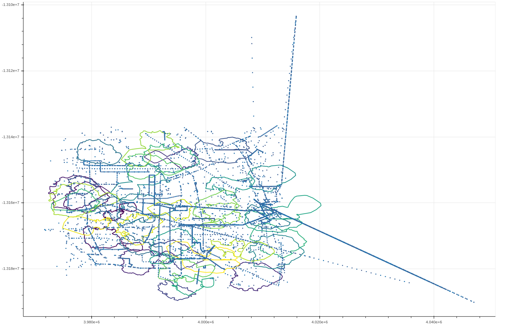

# Geo Data Processing

### About this repository
This repository represents source code of a bachelor thesis at TU Munich.

### Problem description

Geographic coordinates, polygons and geofencing problem are given. Geofencing is the technique to assign points to corresponding polygons. This means we have a set of polygons and a set of points and we need to find which point is inside which polygon. How to make it fast is primary for us.
We concentrate on Point-In-Polygon Problem only (distance between objects is out of scope)

### Methods in  used
We tried two approaches:
 - Using  [S2Geometry](http://s2geometry.io/ ) library
 - Using the approach from [winners](https://dl.acm.org/citation.cfm?id=2525314.2527263) of [GISCUP2013] (http://dmlab.cs.umn.edu/GISCUP2013/faq.php).

### Data
We used data from  [GISCUP2013] (http://dmlab.cs.umn.edu/GISCUP2013/downloads.php). 
Hence we have 70K points and 40 polygons. 

 - There is no natural structure in polygons
 - Polygons are regular 
 - Polygons cross each other
 - One point can be inside many polygons
 
Visualization of polygons and points:

## Results

|                              | S2 Geometry (S2Loops only) | S2 Geometry (S2Loops + Regions) | R-Tree and Interval Tree | R-Tree only |
|------------------------------|----------------------------|---------------------------------|--------------------------|-------------|
| Read and index of polygons   |            167ms           |              806ms              |     37ms + 7ms = 44ms    |     37ms    |
| Calculation                  |           1672ms           |              356ms              |           134ms          |    2159ms   |
|                              |                            |                                 |                          |             |

### Output

  - Time to read polygons and put into R-Star-Tree: `37 ms`
  - Time to read points: `229 ms` 
  - Number of polygons: `30`
  - Number of points: `39289`
  - Time to build Interval Trees: `7 ms` 
  - Time using Boost Polygons: `46737 ms` 
  - Time using R-Star-Tree: `2159 ms` 
  - Time using R-Star-Tree and Interval Trees: `134 ms` 
  
`84,959,2050,1592,784,67,51,1309,0,351,2137,1317,93,2331,1982,2537,24,2306,415,2204,2923,1741,64,126,816,72,1261,308,357,587,`
  

   - Read polygons into S2Loop then build S2RegionCoverer: `806 ms`
   - Read points into S2LatLng : `243 ms`
   - Number of polygons: 30
   - Number of points: 39289
   - Time using only S2Loops: `1679 ms`
   - Time using S2Rect, Exterior and Interior: `365 ms`

`84,959,2050,1592,784,67,51,1309,0,351,2137,1317,93,2331,1982,2537,24,2306,415,2204,2923,1743,64,126,816,72,1261,308,357,587,`
