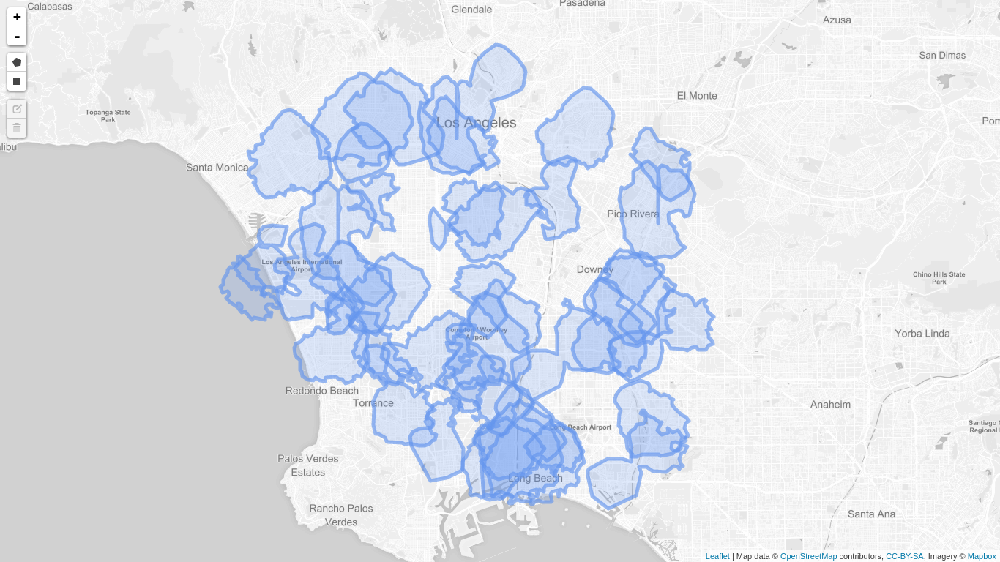

# Geo Data Processing

### About this repository
This repository represents source code of a bachelor thesis at TU Munich.

### Problem description

We have given geographic coordinates, polygons and geofencing problem. Geofencing is the technique to assign points to corresponding polygons. This means we have a set of polygons and a set of points and we need to find which point is inside which polygon. How to make it fast is primary for us.

### Methods in  used
We tried two approaches one is based on [S2Geometry](http://s2geometry.io/ ) library. Second one is based on the approach from [winners](https://dl.acm.org/citation.cfm?id=2525314.2527263) of [GISCUP2013] (http://dmlab.cs.umn.edu/GISCUP2013/faq.php).

### Data
We used data from  [GISCUP2013] (http://dmlab.cs.umn.edu/GISCUP2013/downloads.php). 
Hence we have 70K points and 40 polygons. 

 - There is no natural structure in polygons
 - Polygons are regular 
 - Polygons cross each other
 - One point can be inside many polygons
 
Example of polygons:

Reference-style: 


Example of points:

```$xslt
-118.11442977905256, 33.68069507790899
-118.3441333007807, 33.85434247993032
-118.33226600646968, 33.65153710101381
-118.15757308960022, 33.828400747409695
-118.2344149017334, 33.73838358717207
-118.19757293701208, 33.75396762765742
-118.41520729065005, 33.60314376839062
-118.23602989196844, 33.84564691082011
-118.1732904052727, 33.733610804171754
-118.19474670410213, 33.72215228056522
```

### Results
